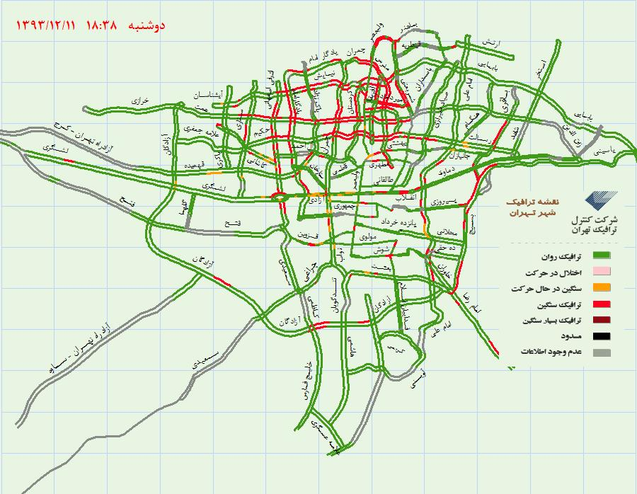

TTM2Youtube
===========
### Tehran Traffic Map to Youtube Video

This program generates a video from [Tehran Traffic Map website](http://31.24.237.150/TTCCTrafficWebSite/PublicUsers/GraphicalTrafficMap/Default.aspx) and uploads it to Youtube.

### Tehran Traffic Map images

Traffic Map images are available as PNG files. This is an example of a traffic map downloaded in rush hour:

Traffic Maps are available as PNG files on Traffic Control server. The PNG file is updated by their ASPX code on 5 minute intervals. Live example here:

